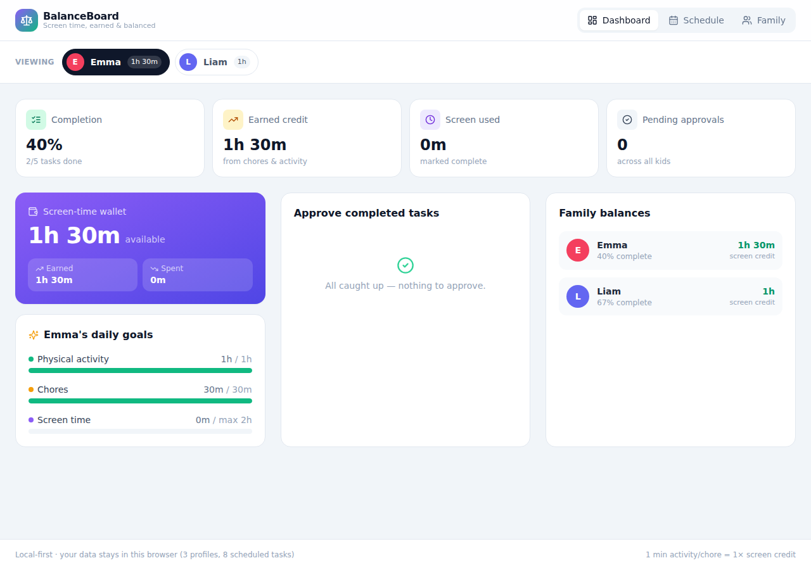

# ⚖️ BalanceBoard

A local-first web app to manage and balance kids' schedules — tracking **screen time** against **chores and physical activity**. Screen time isn't just capped; it's **earned**. Completing (and getting a parent to approve) chores and activity credits a per-kid "screen-time wallet" that screen time then spends down.



## Highlights

- **Family profiles** — parents and kids, each kid with editable daily goals (screen cap, activity minimum, chores minimum) and an avatar color.
- **Drag-and-drop weekly schedule** — a 7-day × hourly grid. Drag task blocks to reschedule, double-click an empty cell (or hit the `+`) to add a task, click a block to edit, tap the circle to mark it done.
- **The Balance Engine** — the core rule: `earned credit = Σ approved activity+chore minutes × earnRate`, `spent = Σ completed screen minutes`, `wallet = earned − spent`. Screen blocks that would overdraw the wallet are flagged. The earn rate is tunable (e.g. 0.5× = 30 min of chores unlocks 15 min of screen).
- **Parent dashboard** — completion rate, earned/spent totals, an **approval queue** (kids mark tasks done; parents approve to release the credit), per-kid daily-goal progress, and a family-wide balance overview.
- **Local-first & offline** — all state lives in `localStorage`; no backend, no accounts, no network. The persistence layer (`src/lib/storage.js`) is isolated behind a `load()/save()` contract so a SQLite/Express backend can be swapped in later without touching the reducer or UI.

## Tech stack

- **React 18** + **Vite**
- **Tailwind CSS** for styling
- **@dnd-kit** for drag-and-drop
- **lucide-react** for icons
- **useReducer + Context** for state, persisted to `localStorage`

## Getting started

```bash
npm install     # install dependencies
npm run dev     # start the dev server (http://localhost:5173)
```

Other commands:

```bash
npm run build     # production build into dist/
npm run preview   # preview the production build
```

The app seeds a demo family (Emma & Liam) on first run. Use **Family → Reset app to demo data** to start over.

## Project structure

```
src/
  main.jsx                 App entry, wraps the tree in <StoreProvider>
  App.jsx                  Layout + tab navigation
  index.css                Tailwind entry + small custom styles
  state/
    store.jsx              useReducer store, Context, localStorage persistence
  lib/
    constants.js           Task categories, days/hours grid, formatters
    storage.js             localStorage load/save (swappable backend seam)
    seed.js                Initial demo data
    balanceEngine.js       Pure balance/goal/completion logic (no React)
  components/
    ProfileSwitcher.jsx    Kid selector with live wallet balances
    Dashboard.jsx          Parent dashboard: stats, approvals, goals, balances
    ScheduleView.jsx       Drag-and-drop weekly calendar grid
    TaskModal.jsx          Create/edit a task block
    ProfilesView.jsx       Family management + goals + balance-rule settings
    BalanceWidgets.jsx     Wallet card, goal bars, stat tiles
```

## The balance model

| Category            | Effect on wallet        | Notes                                        |
| ------------------- | ----------------------- | -------------------------------------------- |
| Physical Activity   | **+ earns** credit      | counts only after parent approval            |
| Chore               | **+ earns** credit      | counts only after parent approval            |
| Screen Time         | **− spends** credit     | flagged if it would overdraw the wallet      |
| Homework            | neutral                 | tracked for completion rate only             |

A kid marks a task done → it enters the parent's **approval queue** → on approval the credit is released into the wallet. Screen time can then be scheduled and completed against that balance.
